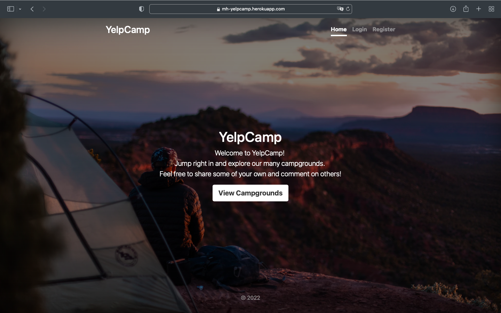
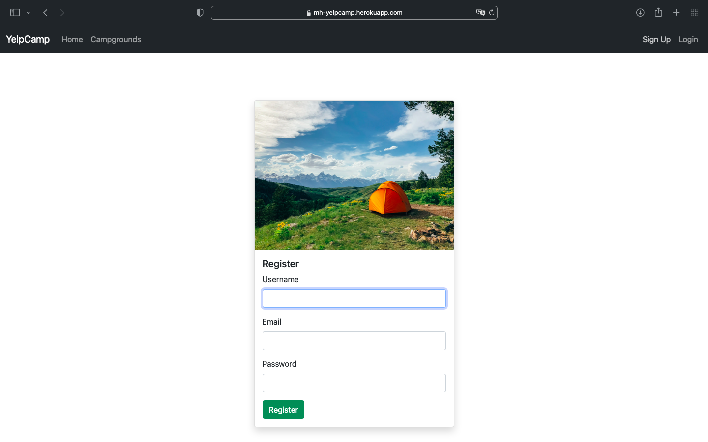
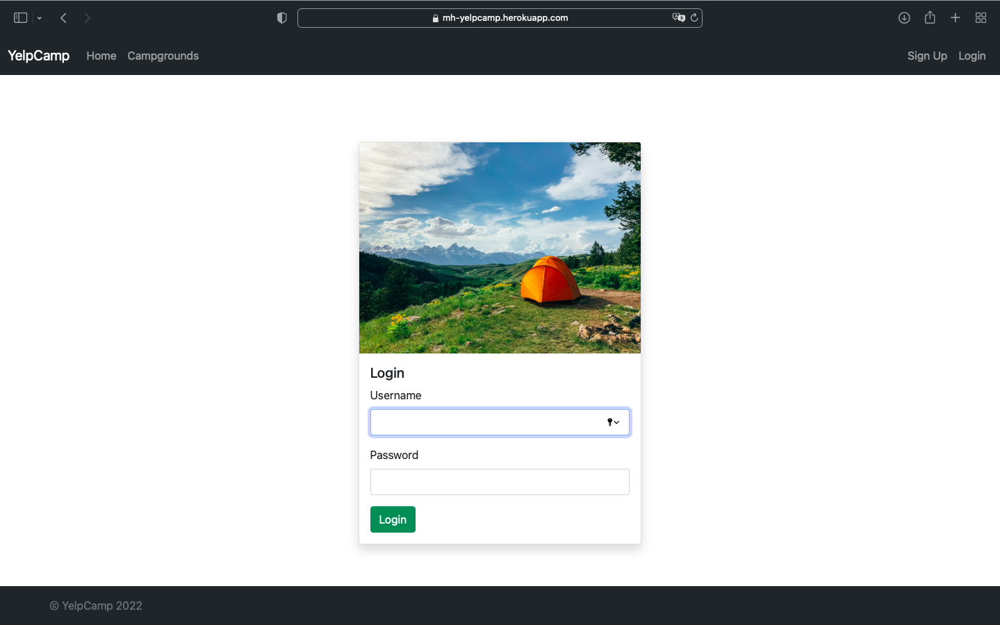
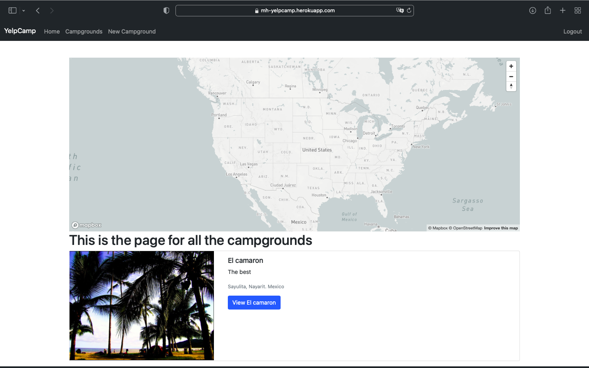
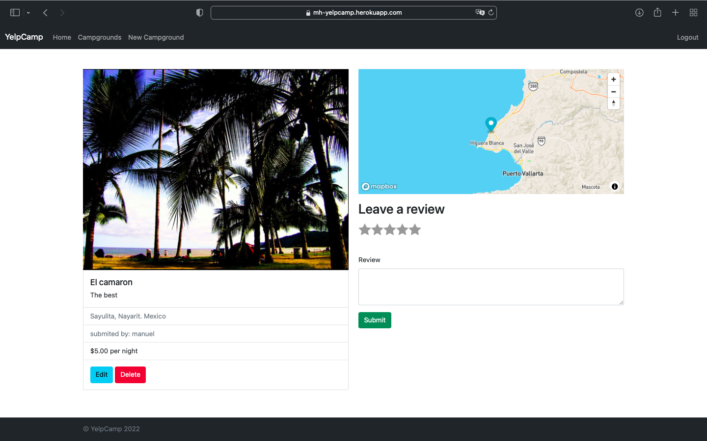
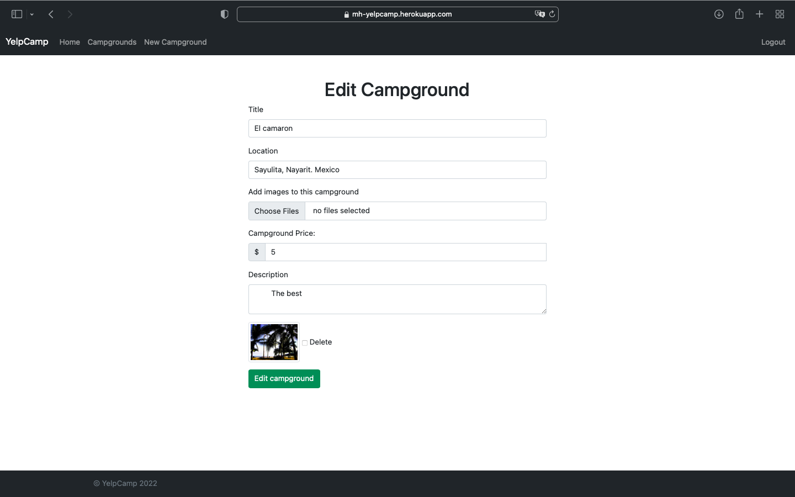
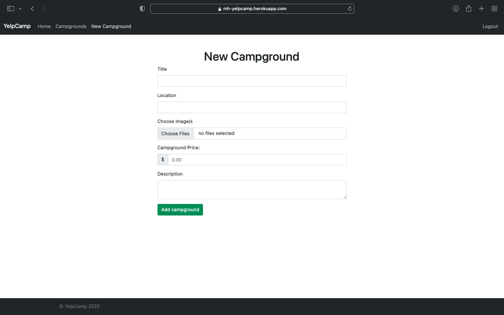

# Project: A Node-Express-MongoDB-Mongoose Full-stack CRUD Application with authentication, use of maps, file/image upload

---

## Content ;

1. Title Of The App & Quick Intro.
2. App Screenshots.
3. Technologies Used.
4. Getting Started.

---

---

### 1. Title Of The App :

Yelpcamp.

---

### 1. Intro :

This is a CRUD application built using MongoDB, Mongoose, MongoDB Atlas, Node.js, Express, and map services. The app allows users to create, read, update, and delete posts and comments. Each user has a profile where they can manage their posts and interact with other users' comments. The integration of map services provides additional functionality and enhances the user experience.

---

### 2. App Screenshots :

1. Home page.

2. Registration page

3. Login page

4. All posts page

5. One post page

6. Edit campground page

7. New campground page

---

### 3. Technologies Used :

1. HTML
2. CSS
3. JavaScript
4. MongoDB
5. Mongoose
6. NodeJS
7. Express
8. CDN & NPM external libraries/packages integration
9. Interactive maps
10. API calls
11. Authentication
12. Authorization
13. File/Image upload
14. bootstrap

---

### 4. Getting Started :

Click [here](https://yelpcamp-murex-ten.vercel.app/home) to checkout the app.

---
